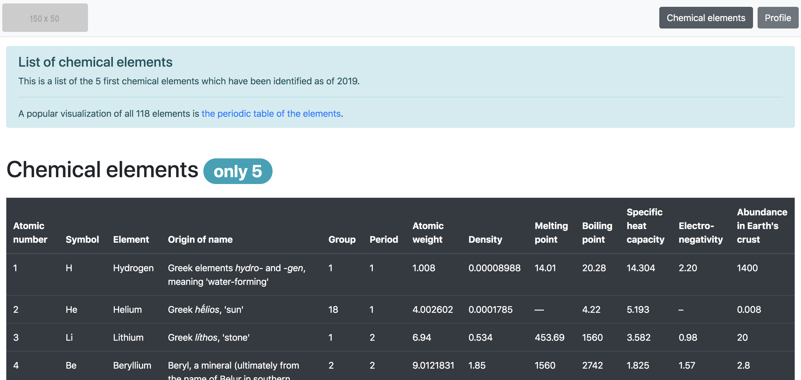

# Bootstrap

## Resource
[Bootstrap](`https://getbootstrap.com/docs/4.4/getting-started/introduction/`)

## Learning objectives
The usage of Containers
The usage of the Grid system
The usage of Components
The usage of Utilities

## Use CDN version
```sh
<link rel="stylesheet" href="https://stackpath.bootstrapcdn.com/bootstrap/4.4.1/css/bootstrap.min.css" integrity="sha384-Vkoo8x4CGsO3+Hhxv8T/Q5PaXtkKtu6ug5TOeNV6gBiFeWPGFN9MuhOf23Q9Ifjh" crossorigin="anonymous">
```

### Task0. Reboot styling


### Task1. Blocks


### Task2. Table of chemical elements


### Task3. Cards


### Task4. Bob Dylan


### Task5. Show/Hide - screen size


### Task6. Overwrite CSS

